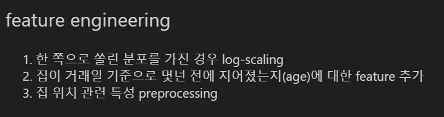
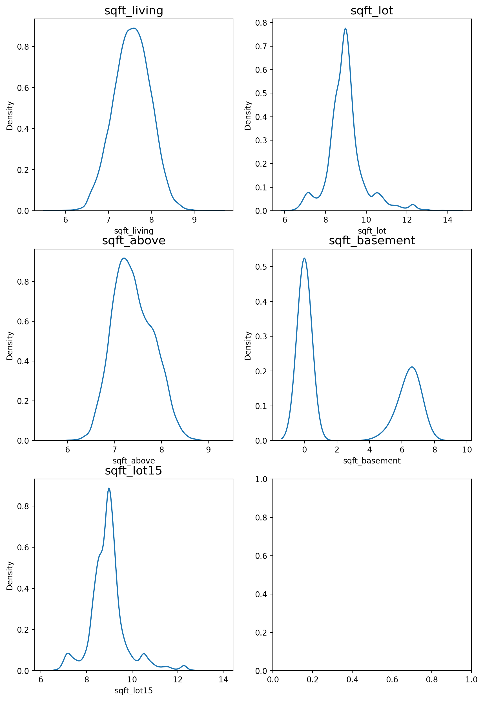
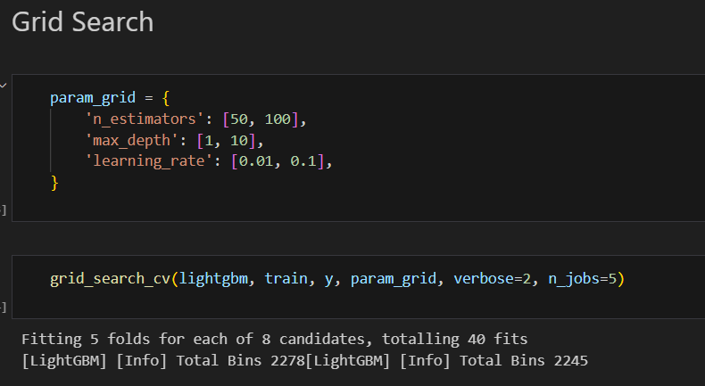
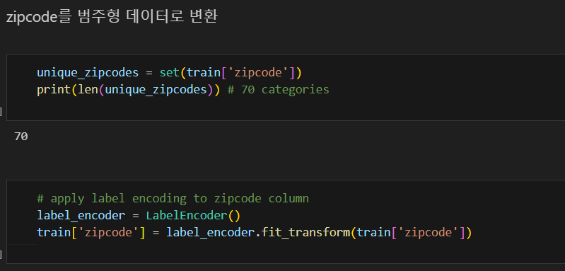
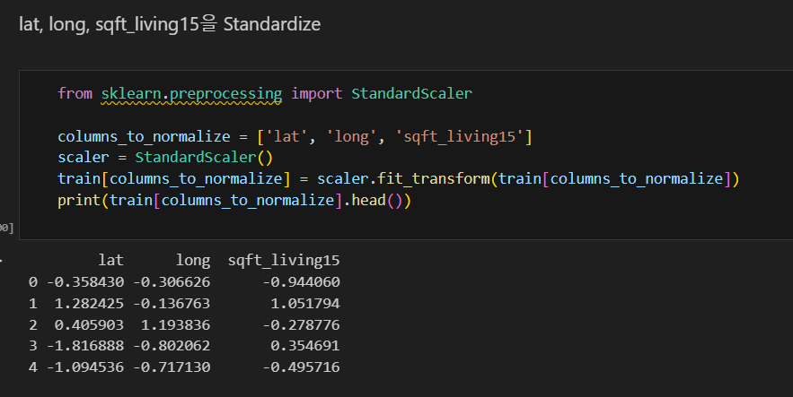
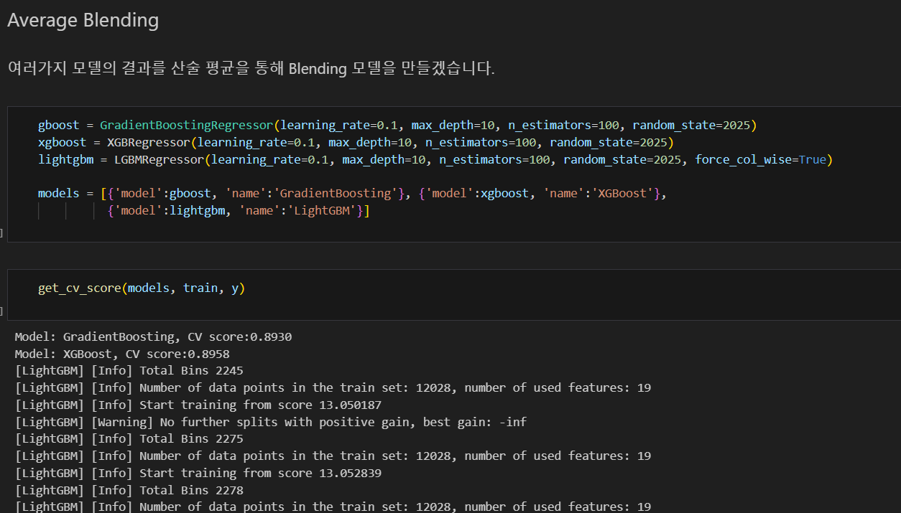
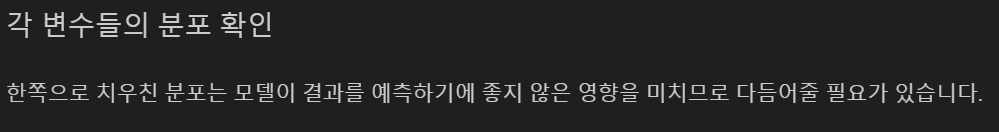
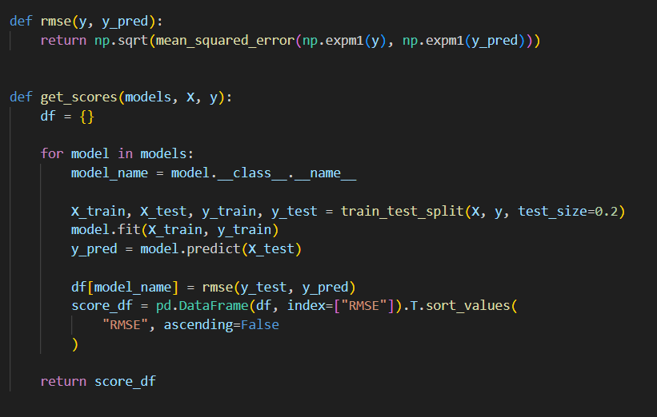

# AIFFEL Campus Online Code Peer Review Templete
- 코더 : 정상헌
- 리뷰어 : 손병진

# PRT(Peer Review Template)
- [X]  **1. 주어진 문제를 해결하는 완성된 코드가 제출되었나요?**
    - 전처리, 시각화, 모델 학습 및 최적화 작업이 체계적으로 기술되어 있음
        - Feature Engineering 수행
          
        - 데이터 시각화
          
        - 모델링 및 Grid 탐색 수행
          
    

- [X]  **2. 전체 코드에서 가장 핵심적이거나 가장 복잡하고 이해하기 어려운 부분에 작성된 
주석 또는 doc string을 보고 해당 코드가 잘 이해되었나요?**
    - 우편번호를 범주형 데이터로 변환하거나 값이 큰 위경도 데이터를 정규화를 통해 모델 성능을 올리고자한 노력이 돋보임.
      
      
        
- [X]  **3. 에러가 난 부분을 디버깅하여 문제를 해결한 기록을 남겼거나
새로운 시도 또는 추가 실험을 수행해봤나요?**
    - 산술 평균으로 활용하여 안정적이고 균형 잡힌 예측 결과를 통해 모델 성능을 올리고자 함
      
        
- [X]  **4. 회고를 잘 작성했나요?**
    - 코드의 전체적인 진행방향과 데이터처리 이유 등을 명시함.
      
        
- [X]  **5. 코드가 간결하고 효율적인가요?**
    - 주요 기능을 함수로 구현하여 효율적으로 사용
      

# 회고(참고 링크 및 코드 개선)
다양한 피처 엔지니어링과 그리드탐색, 앙상블 기법 등을 통해 최적화를 하고자한 모습이 돋보였습니다.
