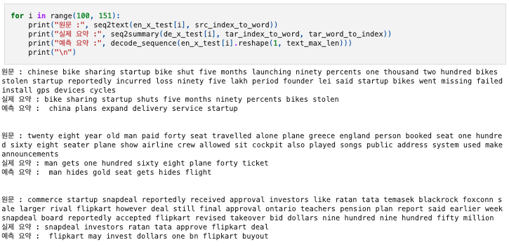
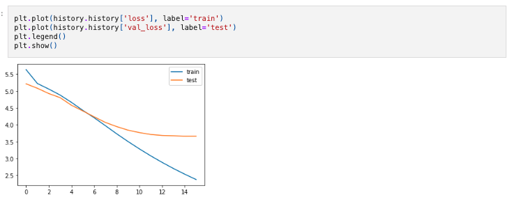
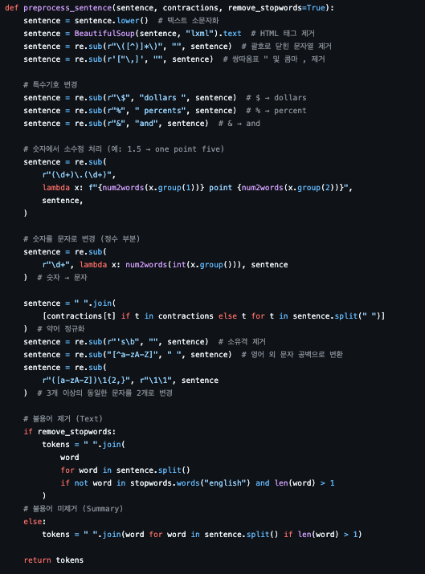
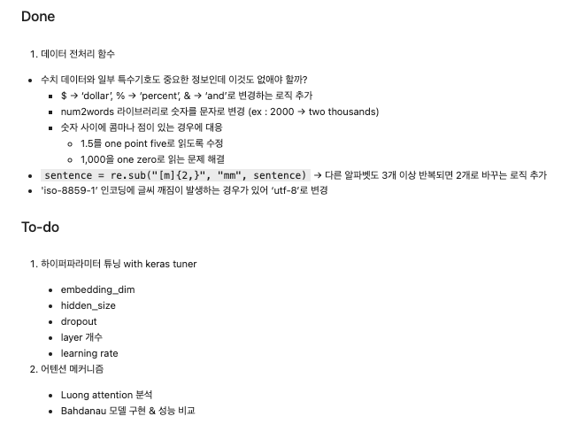
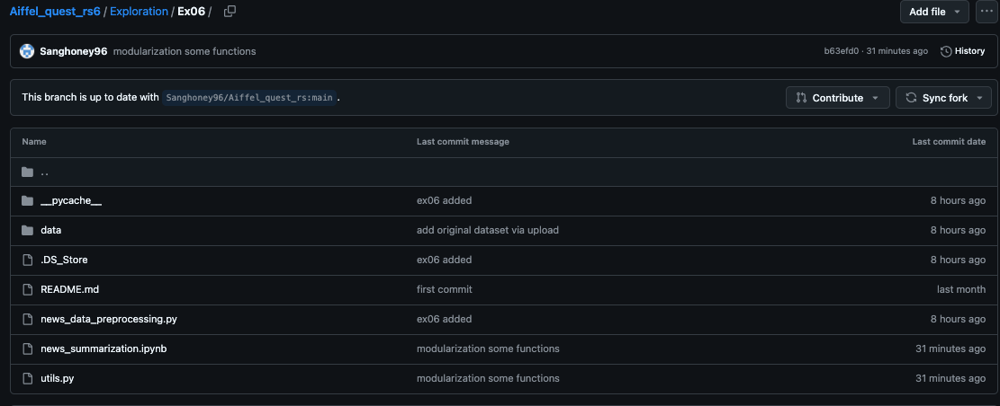

# AIFFEL Campus Online Code Peer Review Templete
- 코더 : 정상헌
- 리뷰어 : 나영진


# PRT(Peer Review Template)
- [0]  **1. 주어진 문제를 해결하는 완성된 코드가 제출되었나요?**
    - 문제에서 요구하는 최종 결과물이 첨부되었는지 확인
        - 중요! 해당 조건을 만족하는 부분을 캡쳐해 근거로 첨부  
            
            
        요구조건에 맞는 결과물을 완성하셨습니다. 추출적 요약과 비교의 경우 데이터만 바꿔서 테스트 해보시면 될 것같습니다.

- [0]  **2. 전체 코드에서 가장 핵심적이거나 가장 복잡하고 이해하기 어려운 부분에 작성된 
주석 또는 doc string을 보고 해당 코드가 잘 이해되었나요?**
    - 해당 코드 블럭을 왜 핵심적이라고 생각하는지 확인
    - 해당 코드 블럭에 doc string/annotation이 달려 있는지 확인
    - 해당 코드의 기능, 존재 이유, 작동 원리 등을 기술했는지 확인
    - 주석을 보고 코드 이해가 잘 되었는지 확인
        - 중요! 잘 작성되었다고 생각되는 부분을 캡쳐해 근거로 첨부      
             
        전처리 부분에 필요하다고 생각되는 부분을 잘 추가해주신것 같습니다. 여러가지 시도를 해보신점이 좋았습니다. 

- [0]  **3. 에러가 난 부분을 디버깅하여 문제를 해결한 기록을 남겼거나
새로운 시도 또는 추가 실험을 수행해봤나요?**
    - 문제 원인 및 해결 과정을 잘 기록하였는지 확인
    - 프로젝트 평가 기준에 더해 추가적으로 수행한 나만의 시도, 
    실험이 기록되어 있는지 확인
        - 중요! 잘 작성되었다고 생각되는 부분을 캡쳐해 근거로 첨부   
             
        데이터 전처리시 발생한 이슈에 대해서 기록 및 개선 해주셨습니다.  
        리뷰어는 float point처리를 고려하지 않았는데, 확인해보고 싶은 부분입니다.

- [0]  **4. 회고를 잘 작성했나요?**
    - 주어진 문제를 해결하는 완성된 코드 내지 프로젝트 결과물에 대해
    배운점과 아쉬운점, 느낀점 등이 기록되어 있는지 확인
    - 전체 코드 실행 플로우를 그래프로 그려서 이해를 돕고 있는지 확인
        - 중요! 잘 작성되었다고 생각되는 부분을 캡쳐해 근거로 첨부
             
        코드에서 이슈와, 개선방법 그리고 Futurework까지 잘 작성해 주셨습닌다.

- [0]  **5. 코드가 간결하고 효율적인가요?**
    - 파이썬 스타일 가이드 (PEP8) 를 준수하였는지 확인
    - 코드 중복을 최소화하고 범용적으로 사용할 수 있도록 함수화/모듈화했는지 확인
        - 중요! 잘 작성되었다고 생각되는 부분을 캡쳐해 근거로 첨부   
          
    전처리 데이터를 저장하여 재사용하였고, 코드도 모듈화하여 작성해주셨습니다. 


# 회고(참고 링크 및 코드 개선)
```
# 리뷰어의 회고를 작성합니다.
# 코드 리뷰 시 참고한 링크가 있다면 링크와 간략한 설명을 첨부합니다.
# 코드 리뷰를 통해 개선한 코드가 있다면 코드와 간략한 설명을 첨부합니다.  
```
리뷰어는 요약이 제대로 작동하지 않는 이슈가 있었는데, 그부분에 대해 같이 비교해보고 얘기해볼 수 있어서 좋았습니다. Futurework까지 진행된다면 더 많은 학습이 될것 같습니다. 고생하셨습니다.