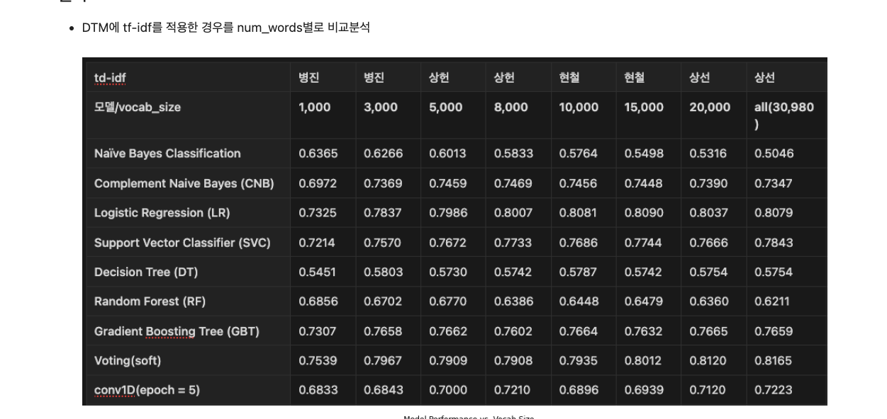
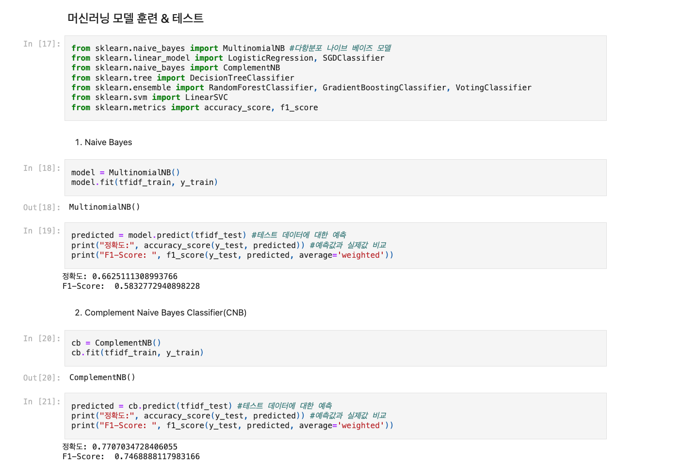
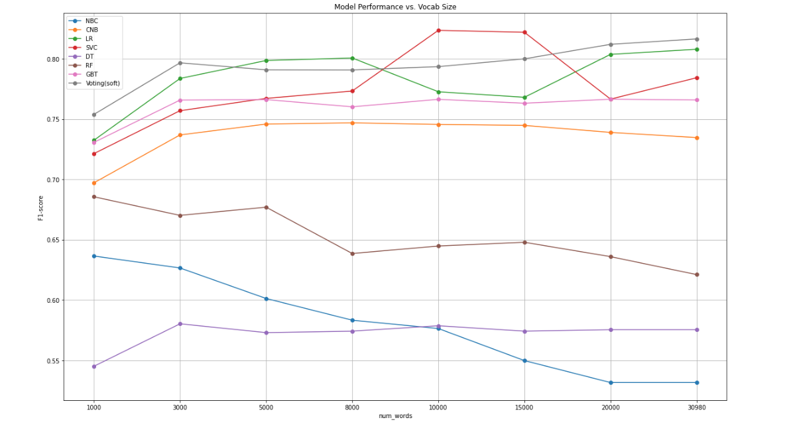
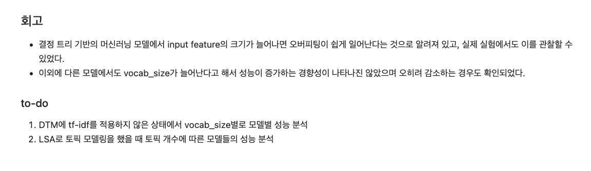
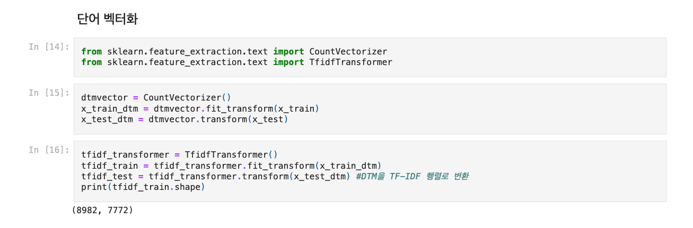

# AIFFEL Campus Online Code Peer Review Templete
- 코더 : 정 상헌
- 리뷰어 : 김 영만


# PRT(Peer Review Template)
- [*]  **1. 주어진 문제를 해결하는 완성된 코드가 제출되었나요?**
    - 다양한 단어 개에 대해 다양한 모델을 적용하였습니다.
        - 
    
- [*]  **2. 전체 코드에서 가장 핵심적이거나 가장 복잡하고 이해하기 어려운 부분에 작성된 
주석 또는 doc string을 보고 해당 코드가 잘 이해되었나요?**
    - 모델들에 대한 정의가 잘 되어 있어 이해 하기 좋았습니다. 
      - 

- [ ]  **3. 에러가 난 부분을 디버깅하여 문제를 해결한 기록을 남겼거나
새로운 시도 또는 추가 실험을 수행해봤나요?**
    - 다양한 추가 실험이 진행 되었습니다.
        - 
        
- [ ]  **4. 회고를 잘 작성했나요?**
    - 결과에 대한 결론 및 앞으로 더 진행 해야 할 부분에 대해 잘 정리 되어 있습니다.
        - 
        
- [ ]  **5. 코드가 간결하고 효율적인가요?**
    - 필요한 코드들로 구성 되어 있어 간결 합니다.
        - 


# 회고(참고 링크 및 코드 개선)
```
리뷰 중에 svd 방식으로 더 진행 해 보겠다고 하여 좋았습니다.
```
