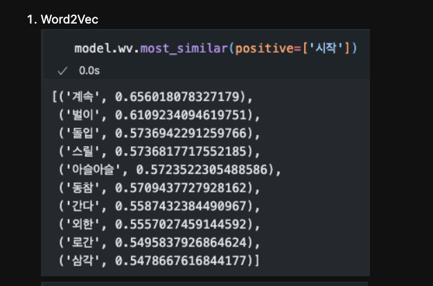
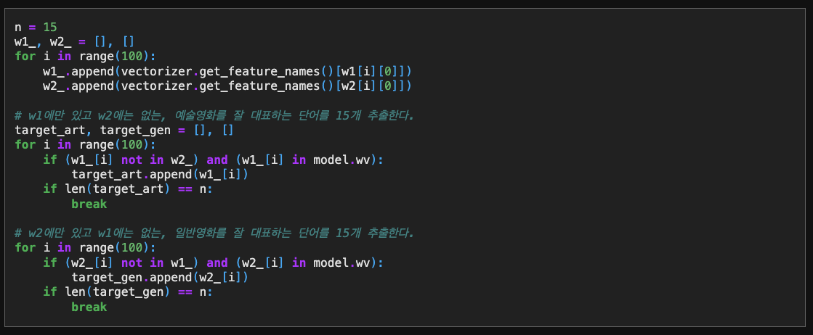
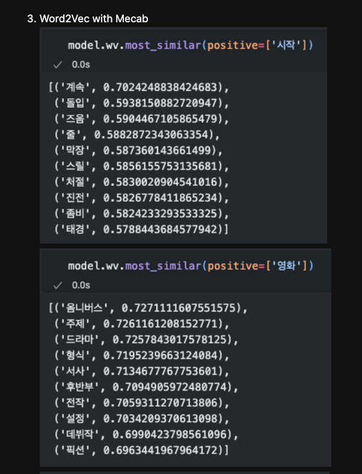
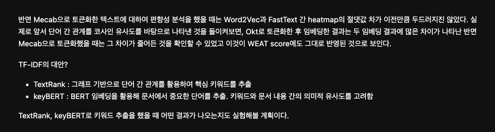
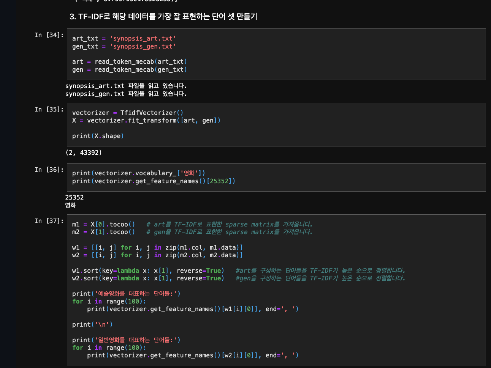

# AIFFEL Campus Online Code Peer Review Templete
- 코더 : 정 상헌
- 리뷰어 : 김 영만


# PRT(Peer Review Template)
- [*]  **1. 주어진 문제를 해결하는 완성된 코드가 제출되었나요?**
    - 주어진 영화 코퍼스를 바탕으로 워드임베딩 모델을 정상적으로 만들었습니다.
        - 
    
- [*]  **2. 전체 코드에서 가장 핵심적이거나 가장 복잡하고 이해하기 어려운 부분에 작성된 
주석 또는 doc string을 보고 해당 코드가 잘 이해되었나요?**
    - 중복된 단어를 삭제하여 분석의 정확도를 높이려 한 부분이 잘 이해가 되었습니다.
       - 

- [*]  **3. 에러가 난 부분을 디버깅하여 문제를 해결한 기록을 남겼거나
새로운 시도 또는 추가 실험을 수행해봤나요?**
    - 모두 4가지 경우에 대해 다양하게 시험 되었습니다.
       - 

        
- [*]  **4. 회고를 잘 작성했나요?**
    - 시험 한 결과에 대한 자세한 설명과 향후 더 진행 해 보아야 할 부분이 언급 되어 있어 좋았습니다.
        - 
        
- [*]  **5. 코드가 간결하고 효율적인가요?**
    - 파이썬 스타일을 준수하고 간결 합니다.
        - 

# 회고(참고 링크 및 코드 개선)
```
4가지의 다양한 분석을 통해 결과를 이끌어 내었고,
향후 진행 할 내용도 언급이 되어 좋은 참고가 되었습니다.
```
