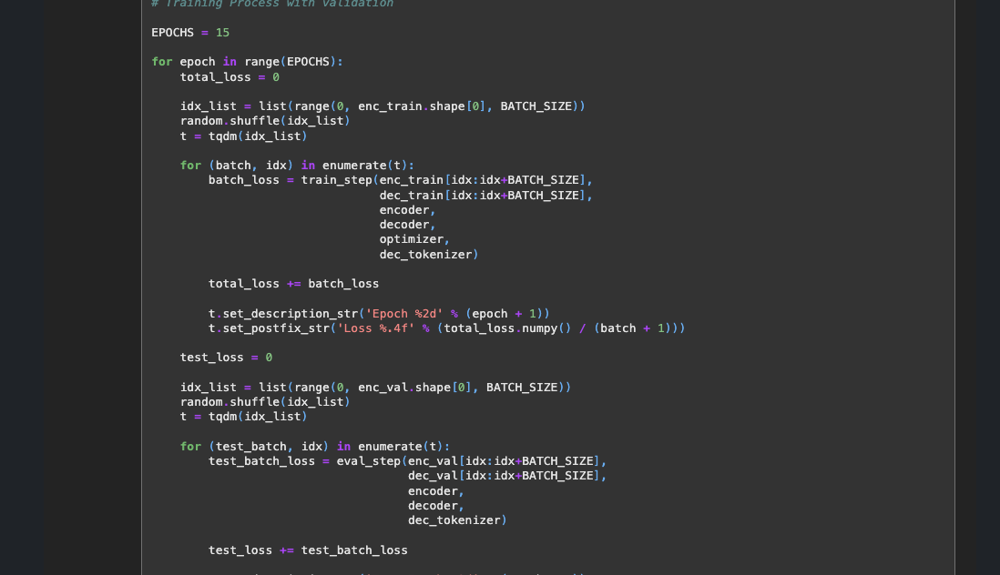

# AIFFEL Campus Online Code Peer Review Templete
- 코더 : 정 상헌
- 리뷰어 : 김 영만


# PRT(Peer Review Template)
- [*]  **1. 주어진 문제를 해결하는 완성된 코드가 제출되었나요?**
    - 한국어를 영어로 번역하는 코드를 완료 하였습니다.
        - 
    
- [*]  **2. 전체 코드에서 가장 핵심적이거나 가장 복잡하고 이해하기 어려운 부분에 작성된 
주석 또는 doc string을 보고 해당 코드가 잘 이해되었나요?**
    - 훈련과 평가에 대한 처리를 명확히 하여 잘 이해 되었습니다. 
        - 
        
- [*]  **3. 에러가 난 부분을 디버깅하여 문제를 해결한 기록을 남겼거나
새로운 시도 또는 추가 실험을 수행해봤나요?**
    - 실패를 통해 개선 한 내용을 기술해 놓았습니다.
        - 
        
- [*]  **4. 회고를 잘 작성했나요?**
    - 개선해야 할 내용에 대해 자세히 기술하였습니다.
        - 
        
- [*]  **5. 코드가 간결하고 효율적인가요?**
    - 데이터 전처리 하는 부분들을 함수화 하여 가독성과 재 사용이 좋습니다.
        - 


# 회고(참고 링크 및 코드 개선)
```
재 사용 가능한 함수 형태로 작성이 되어 참고가 많이 되었습니다.
개선 할 내용에 대해 진도가 있으면 같이 공유 했으면 좋겠다고 생각 했습니다.
수고 하셨습니다.
```
